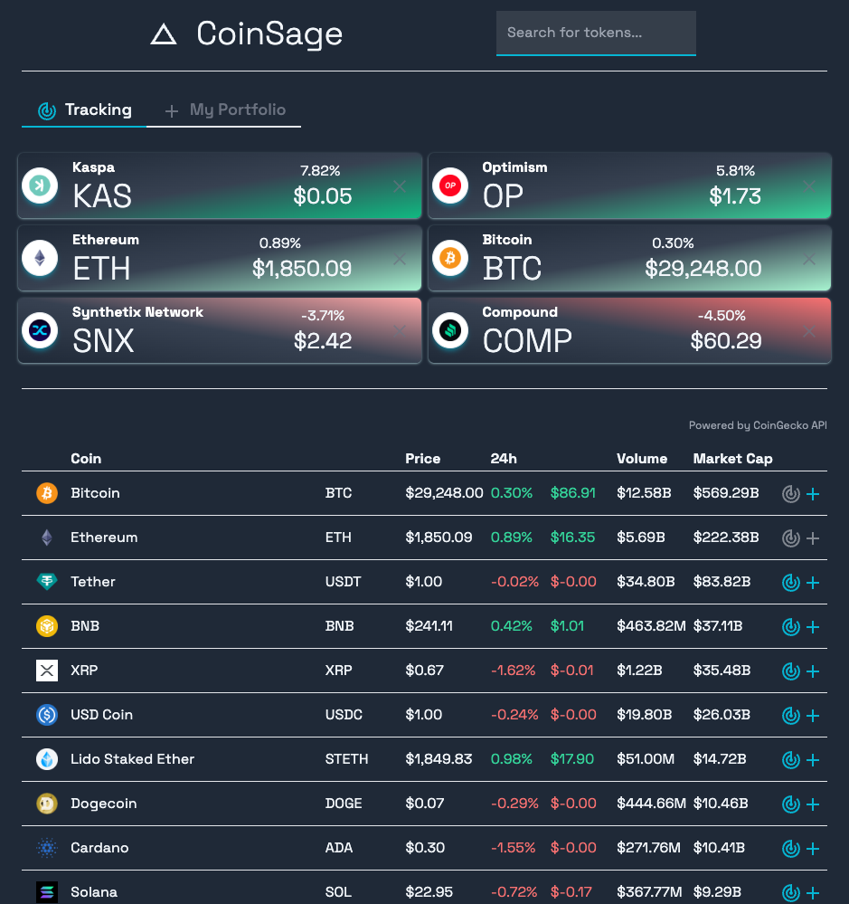
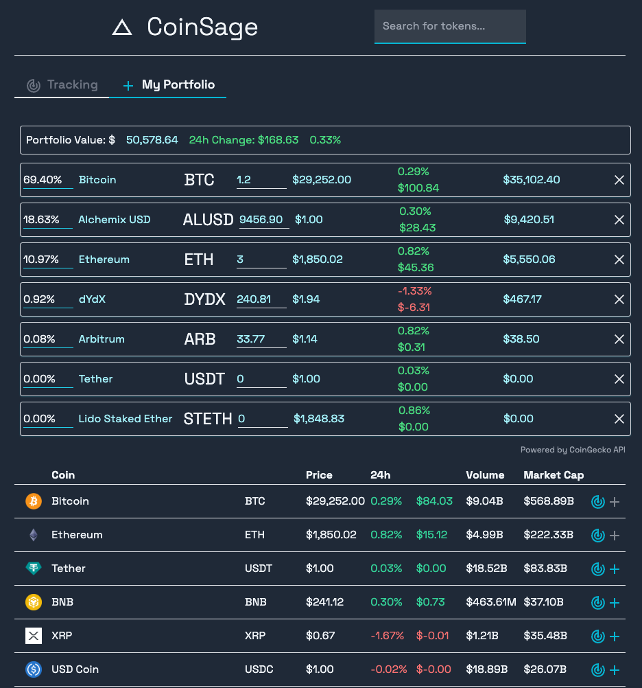
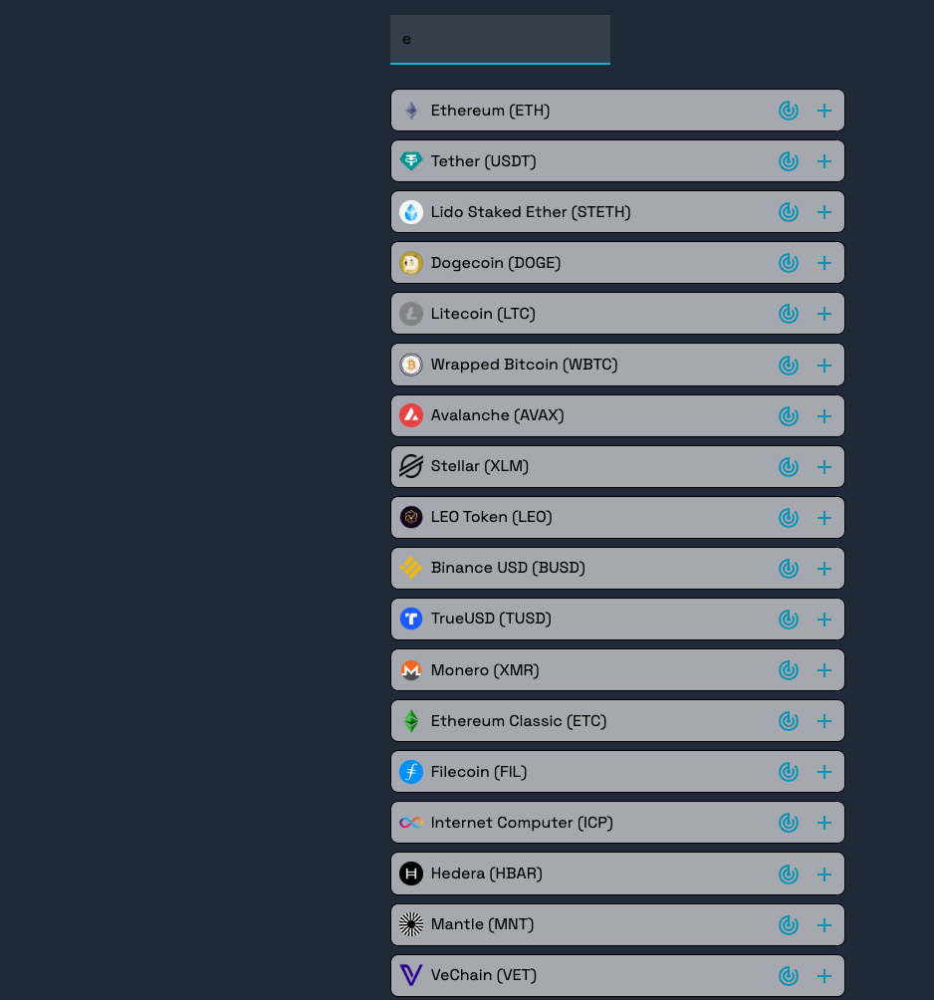

# Coinsage
### A customizable, aesthetic crypto price tracker

Coinsage is a powerful and user-friendly application that lets you stay updated with the latest cryptocurrency prices and manage your crypto portfolio effectively. Whether you are a seasoned crypto trader or a beginner, Coinsage offers the tools you need to track the ever-changing crypto market with ease.

Key Features
- Crypto Price Tracker: Get real-time updates on cryptocurrency prices. Stay informed about price changes, market caps, and trading volumes of your favorite coins.

- Portfolio Tracker: Monitor your crypto portfolio with precision. Keep track of the value of your holdings and track their performance over time.

- Customizable Watchlist: Create your personalized watchlist by adding the cryptocurrencies you are interested in. Quickly access essential information without the clutter.

- User-friendly Interface: Coinsage provides an intuitive and clean interface that makes navigating through the app a breeze.

### Coinsage Tracking View

### Coinsage Portfolio View

### Coinsage Searchbar View

